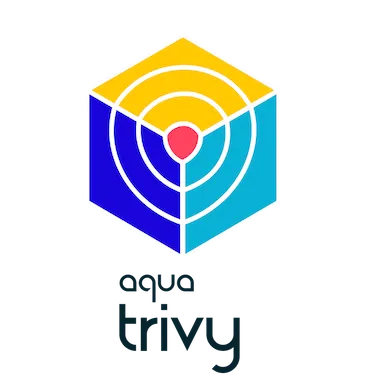

  

<h1 align="center">
   
  Hi, I'm Kamalesh
</h1>

  
  

---

## 🚀 About Me

<table>
<tr>
<td width="50%">

### 💼 Professional Focus

DevOps-focused engineer specializing in **scalable, automated systems** across:

- 🔄 **CI/CD Pipelines** & Infrastructure as Code
- ☁️ **Cloud Infrastructure** (AWS, Azure, GCP)
- 🐳 **Containerization** & Orchestration (Docker, Kubernetes)
- 📊 **Monitoring** & Observability Solutions

</td>
<td width="50%">

### 🎯 Additional Expertise

Bringing an **end-to-end view** of production systems through:

- 🤖 **MLOps Workflows** & Model Deployment
- 🧠 **Deep Learning** & AI Integration
- 💻 **Full-Stack Development** Experience
- ⚡ Focus on **Reliability** & **Automation**

</td>
</tr>
</table>

  
  

---

## 🛠️ Languages & Tools

  
  
  
  
  
  
  
  
  
  
  
  
  
  
  
  
  
  
  
  
  
  
  
  
  
  
  
  
  
  
  

---

## 📊 GitHub Activity

  

---

## 📈 Language Statistics

  

  
  

  
  

---

## 📫 Connect with Me

  
  
  

---

## 💡 Daily Dose of Developer Wisdom

  

---

  <b>⭐️ From <a href="https://github.com/25kamalesh">25kamalesh</a> with 💙</b>

